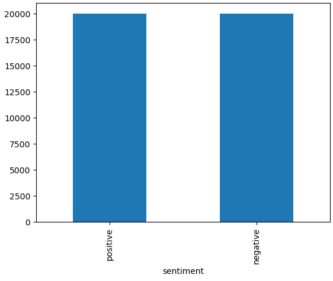
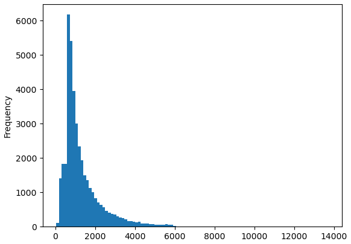
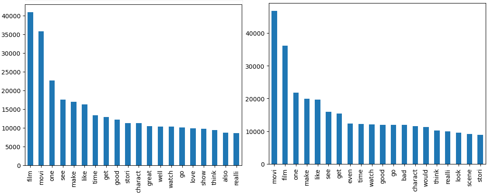

# bstepniewski_final_project
The Final Project in Epam Data Science Course

# ACCURACY
<h3>Inference accuracy: <b>89.09%</b></h3>

<h3>Confusion Matrix:<br>
[4411  502]<br>
[589  4498]

# Running Instruction

1. Clone repository using  ```git clone https://github.com/beto4444/bstepniewski_final_project```
2. <b>If you are using Windows, start Docker using Docker Desktop.</b> This step should be unnecessary on Linux, but if docker don't start, add Docker Daemon to processes: ```sudo systemctl start docker```
3. In directory with cloned repository run command: ```docker build -t bst_final_project .``` First build could take some time so don't worry.
4. After building use:<br>
On Linux: ```docker run -v $(pwd)/results:/app/export bst_final_project```<br>
On Windows PowerShell: ```docker run -v ${PWD}\results:/app/export bst_final_project```<br>
On Windows CMD: ```docker run -v %cd%\results:/app/export bst_final_project```
5. Done, total accuracy should be updated above, predictions are available in results folder in cloned repo(only locally of course.)

# Data Science Part

<i>General remark: More detailed(step-by-step) description of below could be found in notebooks in notebooks folder</i>

## EDA

First of all, the distribution of positive and negative reviews was checked. Fortunately amount of pos. and neg. reviews is equal:<br>

<br>
<br>
After that the avg. review length was checked. Results are below:<br>

<br>
<br>
But the most important for this section was checking most frequent word in both positive and negative reviews. It allow to remove most frequent words from both datasets. Results are below:

<br>
<br>
According to that 5 words was removed: 'movie', 'film', 'one', 'even', 'get'

## Text preparation

Few steps was taken in order as below. Those steps are described in more detail in text_preparation notebook.<br>

1. Remove URLs
2. Remove HTML markers(there was plenty of them)
3. Remove non-alphabetic characters
4. Remove redundant spaces
5. Reduce all letters to lower case
6. Tokenize
7. Remove Stopwords using NLTK
8. Lemmatize or stem depending on choice
9. Clean short words(with length lower than 3)
10. Remove mentioned above most frequent words in both pos. and neg. reviews
11. Return to string form

Past of that encoding of sentiment parameter: 0 - negative review, 1 - positive review
## Stemming vs Lemmatization, TF-IDF vs Bag-Of-Words

All four combinations of above(Stemming + TF-IDF, St + BOW, Lemmatization + TF-IDF, Lem. + BOW) was compared in terms of accuracy of model. Program still generates both Lemmatized and Stemmed form of reviews, also TF-IDF and BOW are both implemented so user can freely choose between them changing parameters in config file. Influence of this on accuracy of model will be described below, but generally there is no big difference between this options.

## Models
<i> Everything is done step by step in model_coparison notebook</i>

Three models was analyzed:<br>
1. Random Forest Classifier, n_estimators=100
2. Logistic Regression
3. Sequential Neural Network with layers:
   1. Dense layer, input_dim = 5000, ReLU activation, 500 neurons
   2. Dropout layer
   3. Dense layer, Sigmoid Activation, 1 neuron

So, because we have 2 methods of vectorization, stemming and lemmatization, and 3. models, 12 combinations was compared. Results(accuracy) are below:<br>

<b>Random Forest Classifier:</b><br>
Lemmatized BOW Accuracy:  0.83975<br>
Stemmed BOW Accuracy:  0.83975<br>
Lemmatized TF-IDF Accuracy:  0.84675<br>
Stemmed TF-IDF Accuracy:  0.84675<br><br>
<b>Logistic Regression</b><br>
Lemmatized BOW Logistic Regression Accuracy:  0.8625<br>
Stemmed BOW Logistic Regression Accuracy:  0.8625<br>
Lemmatized TF-IDF Logistic Regression Accuracy:  0.88275<br>
Stemmed TF-IDF Logistic Regression Accuracy:  0.88275<br><br>
<b>Neural network</b><br>
Lemmatized BOW Neural Network Accuracy:  0.8765<br>
Stemmed BOW Neural Network Accuracy:  0.877875<br>
Lemmatized TF-IDF Neural Network Accuracy:  0.87225<br>
Stemmed TF-IDF Neural Network Accuracy:  0.87525<br><br>

We can see that Logistic Regression with lemmatized/stemmed(no difference here) and TF-IDF vectorization gives best results at all, and is of course above the target, it is 0.85. Moreover, is definitely the fastest model here. Because of that, combination:<br><br>
<b>Lemmatization</b><i>(here is my fantasy, as above no difference in test data)</i><br>
<b>TF-IDF Vectorization</b><br>
<b>Logistic Regression Model</b><br><br>
Is selected configuration.

## Potential business applications and value for business

<b>Business Applications:</b>

* Enhanced Customer Insights
* Improved Product and Service Development
* Customer Experience Optimization
* Market Research and Competitive Analysis
* Automated Support and Interaction

<b>Business Value:</b>

Automating review classification enhances efficiency, enabling businesses to swiftly adapt to customer needs, improve satisfaction, and inform data-driven decisions. <br>This process aids in maintaining a positive brand reputation, fostering customer loyalty, and identifying competitive advantages, thereby supporting strategic business growth.

